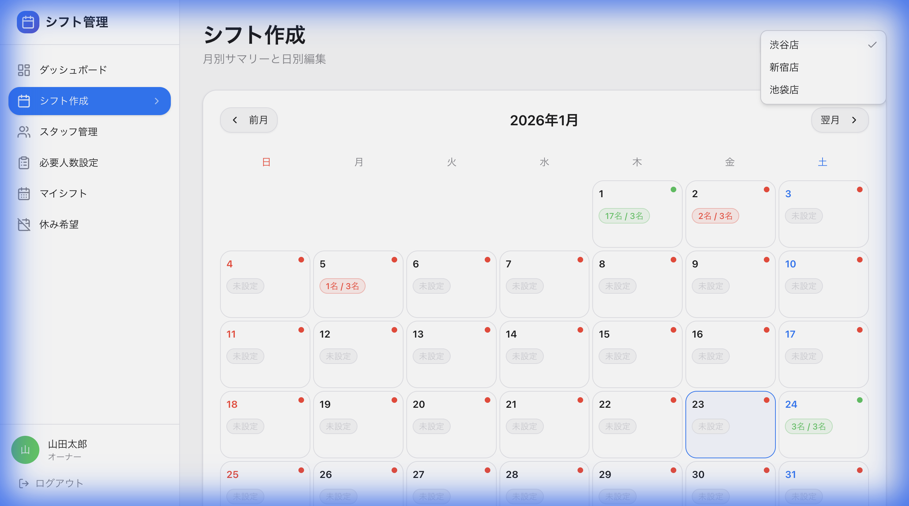

# 1月5日のシフト作成テスト結果報告

## 概要
デプロイ環境 (`https://convenienceshift.vercel.app/`) にて、1月5日のシフト作成機能の動作確認を行いました。

## テスト結果
**ステータス**: ✅ 成功

### 検証内容
1. **ログイン**: 山田太郎 (Owner) として正常にログイン。
2. **画面遷移**: Dashboard > シフト管理 > 渋谷店 へ遷移。
3. **シフト作成**:
    - 対象日: **2026年1月5日**
    - スタッフ: 清水莉子
    - 時間: 09:00 - 17:00
    - 結果: 正常に保存され、カレンダー上に反映されました。

### エビデンス

#### 動画
シフト作成の一連の流れです。

#### スクリーンショット
作成後のカレンダー表示です。1月5日に「1名 / 3名」と表示され、シフトが登録されていることが確認できます。

## 結論
1月5日のシフト作成機能は正常に動作しています。
